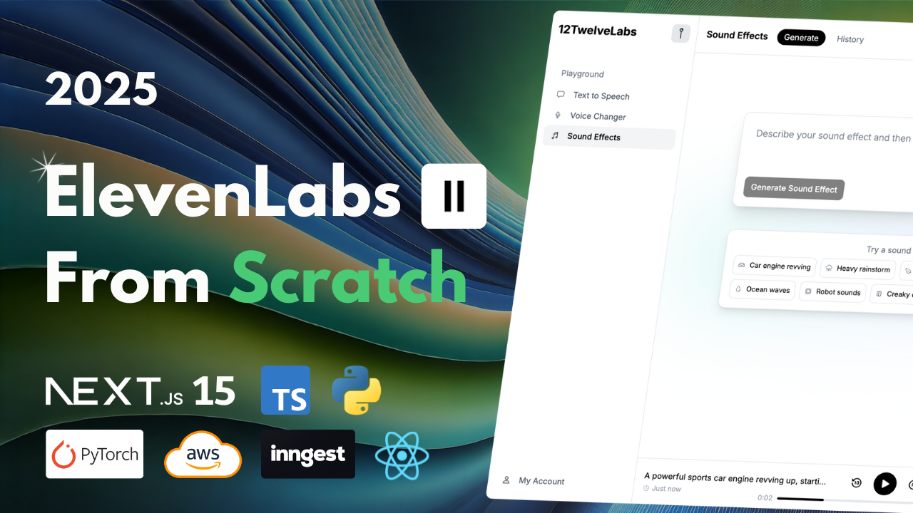

# 🎙️ ElevenLabs Clone – Self-Hosted AI Audio Studio

## 🚀 Overview

This is a full-stack, self-hosted clone of ElevenLabs — your all-in-one AI audio generation playground. 🔥 Instead of relying on external APIs, we host our own cutting-edge models for:

- **🔊 Text-to-Speech (TTS)** with **StyleTTS2**
- **🎭 Voice Conversion** with **Seed-VC**
- **🎵 Text-to-Audio** with **Make-An-Audio**

All models are fine-tuned for custom voices, containerized via Docker 🐳, and exposed through blazing-fast FastAPI endpoints ⚡. The frontend is powered by **Next.js** and the **T3 Stack**, offering a modern, responsive UI with voice selection, audio history, and full user management. Auth.js handles authentication, credits are managed dynamically, and Inngest keeps your AI infra from getting overwhelmed 🛡️.

---

## ✨ Features at a Glance

- 🔊 **StyleTTS2** for lifelike text-to-speech
- 🎭 **Seed-VC** for seamless voice cloning
- 🎵 **Make-An-Audio** for creative audio generation
- 🧠 Fine-tuning for unique voice identities
- 🐳 Dockerized AI stack for easy deployment
- ⚙️ FastAPI backend with scalable endpoints
- 🪙 User credit system
- 🌀 Inngest queue to manage workload
- ☁️ AWS S3 integration for audio file storage
- 👥 Multiple pre-trained voice models
- 🖥️ Fully responsive UI with **Next.js + Tailwind CSS**
- 🔐 Secure authentication with **Auth.js**
- 🎛️ Voice picker component
- 📝 Audio history tracking

---

## 🧠 Models Used

| Purpose             | Model Name                                                             |
| ------------------- | ---------------------------------------------------------------------- |
| Voice-to-Voice      | [`seed-vc`](https://github.com/Plachtaa/seed-vc)                       |
| Fine-tuned TTS      | [`StyleTTS2FineTune`](https://github.com/IIEleven11/StyleTTS2FineTune) |
| Text-to-Speech      | [`StyleTTS2`](https://github.com/yl4579/StyleTTS2)                     |
| Text-to-SFX / Audio | [`Make-an-audio`](https://github.com/Text-to-Audio/Make-An-Audio)      |

---

## 🛠️ Setup Instructions

### 1️⃣ Clone the Repository

```bash
git clone https://github.com/BernieTv/ElevenLabs-Clone.git
```

### 2️⃣ Navigate to Project Directory

```bash
cd elevenlabs-clone
```

### 3️⃣ Install Python 🐍

Ensure Python 3.10 is installed. If not, download it here:  
👉 [Download Python](https://www.python.org/downloads/)

> **Note:** Create a virtual environment for _each model folder_ except `elevenlabs-clone-frontend`.

---

## 📦 Install Dependencies

### ➤ Frontend (Next.js)

```bash
cd elevenlabs-clone-frontend
npm install
```

### ➤ AI Model Folders (Repeat for each)

```bash
cd seed-vc  # example
pip install -r requirements.txt
```

---

## 🔐 AWS IAM Setup

You'll need two IAM entities to handle S3 and EC2 integration:

### 1️⃣ User: `styletts2-api`

**Purpose:** Upload & fetch audio files from S3

**Custom Policy:**

```json
{
  "Version": "2012-10-17",
  "Statement": [
    {
      "Effect": "Allow",
      "Action": ["s3:PutObject", "s3:GetObject", "s3:ListBucket"],
      "Resource": [
        "arn:aws:s3:::elevenlabs-clone",
        "arn:aws:s3:::elevenlabs-clone/*"
      ]
    }
  ]
}
```

---

### 2️⃣ Role: `elevenlabs-clone-ec2`

**Purpose:** EC2 access to S3 + ECR

**Attach Permissions:**

- `AmazonEC2ContainerRegistryFullAccess`
- `AmazonS3FullAccess`

**Custom Policy:**

```json
{
  "Version": "2012-10-17",
  "Statement": [
    {
      "Effect": "Allow",
      "Action": ["s3:PutObject", "s3:GetObject", "s3:ListBucket"],
      "Resource": [
        "arn:aws:s3:::elevenlabs-clone",
        "arn:aws:s3:::elevenlabs-clone/*"
      ]
    }
  ]
}
```
